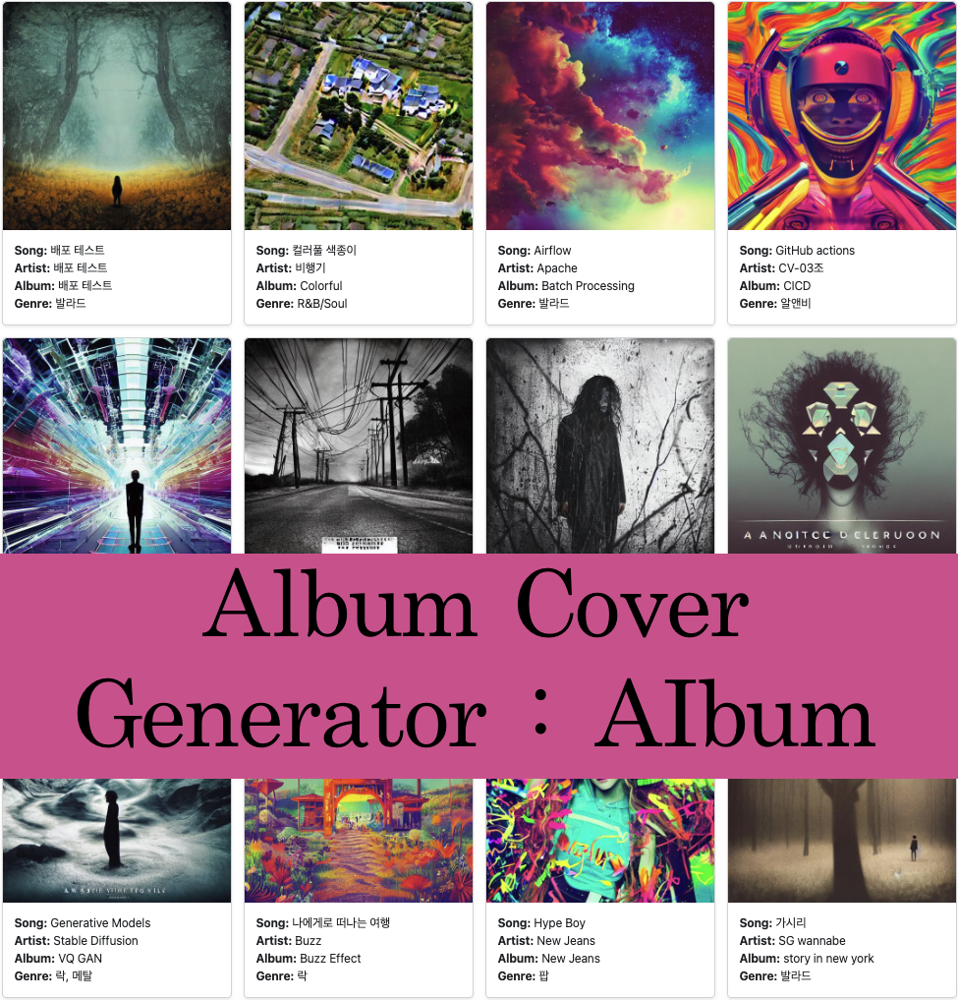
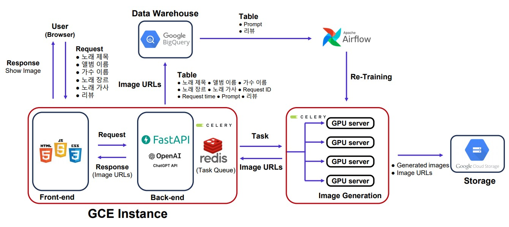

<p align="center">
    <picture>
        
    </picture>
    <div align="center">
        
        
        
        
        
        
        
    </div>
</p>

# <br/><p align="center">💽 앨범 표지 맞춤 제작 서비스 💽</p>
# ✨ 팀 소개

Thanks goes to these wonderful people ([emoji key](https://allcontributors.org/docs/en/emoji-key)):

<div align="center">
    <table>
    <tr>
        <td align="center"><a href="https://github.com/seungki1011"><br /><sub><b>김승기</b></sub><br />
        <a href="https://github.com/boostcampaitech5/level3_cv_finalproject-cv-03/commits?author=seungki1011" title="Code">💻</a>
        <a href="https://github.com/boostcampaitech5/level3_cv_finalproject-cv-03" title="Infra">🚇</a>
        <a href="https://github.com/boostcampaitech5/level3_cv_finalproject-cv-03/pulls?q=" title="Review">👀</a>
        <a href="https://github.com/boostcampaitech5/level3_cv_finalproject-cv-03/issues" title="Question">💬</a>
        </td>
        <td align="center"><a href="https://github.com/jjjuuuun"><br /><sub><b>김준영</b></sub></a><br />
        <a href="https://github.com/boostcampaitech5/level3_cv_finalproject-cv-03/commits?author=jjjuuuun" title="Code">💻</a>
        <a href="https://github.com/boostcampaitech5/level3_cv_finalproject-cv-03" title="Data">🔣</a>
        <a href="https://github.com/boostcampaitech5/level3_cv_finalproject-cv-03/blob/develop/.github/workflows/testing.yaml" title="Test">⚠️</a>
        <a href="https://github.com/boostcampaitech5/level3_cv_finalproject-cv-03/issues" title="Talk">📢</a>
        </td>
        <td align="center"><a href="https://github.com/helpmeIamnewbie"><br /><sub><b>전형우</b></sub></a><br />
        <a href="https://github.com/boostcampaitech5/level3_cv_finalproject-cv-03/commits?author=helpmeIamnewbie" title="Code">💻</a>
        <a href="https://github.com/boostcampaitech5/level3_cv_finalproject-cv-03/tree/develop/src/scratch/dreambooth" title="Infra">🚇</a>
        <a href="https://github.com/boostcampaitech5/level3_cv_finalproject-cv-03/pulls?q=" title="Research">🔬</a>
        <a href="https://github.com/boostcampaitech5/level3_cv_finalproject-cv-03" title="Test">⚠️</a>
        </td>
        <td align="center"><a href="https://github.com/CheonJiEun"><br /><sub><b>천지은</b></sub></a><br />
        <a href="https://github.com/boostcampaitech5/level3_cv_finalproject-cv-03/commits?author=CheonJiEun" title="Code">💻</a>
        <a href="https://github.com/boostcampaitech5/level3_cv_finalproject-cv-03/pulls?q=is%3Apr+is%3Aclosed" title="Research">🔬</a>
                <a href="https://github.com/boostcampaitech5/level3_cv_finalproject-cv-03/tree/develop/src/scratch/htdocs" title="Design">🎨</a>
        <a href="https://github.com/boostcampaitech5/level3_cv_finalproject-cv-03" title="Test">⚠️</a>
        </td>
        <td align="center"><a href="https://github.com/Eyecaramba"><br /><sub><b>신우진</b></sub></a><br />
        <a href="https://github.com/boostcampaitech5/level3_cv_finalproject-cv-03/commits?author=Eyecaramba" title="Code">💻</a>
        <a href="https://github.com/boostcampaitech5/level3_cv_finalproject-cv-03" title="Ideas">🤔</a>
        <a href="https://github.com/boostcampaitech5/level3_cv_finalproject-cv-03/pulls?q=" title="Research">🔬</a>
        <a href="https://github.com/boostcampaitech5/level3_cv_finalproject-cv-03" title="Infra">🚇</a>
    </td>
  </tr>
</table>
</div>

This project follows the [all-contributors](https://github.com/all-contributors/all-contributors) specification. Contributions of any kind welcome!

# 💀 프로젝트 소개

<p align="center">
    <picture>
        
    </picture>
</p>


앨범 표지는 가수와 그의 팬들 사이의 첫 만남입니다. 처음 만나는 순간의 중요성은 첫사랑, 첫 만남, 첫 인상과 같은 기억 속에서도 느껴집니다. 이러한 중요성은 영화 포스터나 유튜브 썸네일과 같이 앨범 커버도 작품의 분위기와 아티스트의 이미지를 대변합니다. 하지만 앨범 제작은 많은 비용과 시간이 소요되는 작업입니다. 본 프로젝트는 이러한 과정을 단순화하여 빠르고 쉽게 맞춤형 앨범 커버를 제작하는 서비스를 제공합니다. 


해당 프로젝트는 `Boostcamp AI Tech` 내에서 진행된 최종 프로젝트입니다.

# 📆 프로젝트 일정

프로젝트 전체 일정

- 2023.07.03 ~ 2023.07.28

프로젝트 세부 일정

-  ~ 2023.06.25 : 주제 선정
- 2023.06.26 ~ 2023.06.30 : Dataset Search 및 Model Research
- 2023.07.01 ~ 2023.07.02 : Dataset Crawling
- 2023.07.03 ~ 2023.07.11 : Stable Diffusion 학습 파이프라인 구축 및 FastAPI를 이용한 Scratch 제작 
- 2023.07.11 ~ 2023.07.12 : BigQuery와 Google Cloud Storage를 사용해 DataWarehouse 구축
- 2023.07.12 ~ 2023.07.13 : Error Reporting
- 2023.07.13 ~ 2023.07.28 : Dreambooth와 Stable Diffusion을 활용한 Fine-Tuning 실험
- 2023.07.12 ~ 2023.07.28 : Celery, Redis, FastAPI를 활용한 Back-End 구축
- 2023.07.17 ~ 2023.07.28 : Front-End와 Github Action을 활용한 CI 구축, Airflow 연결
- 2023.07.28 ~ : 프로젝트 마무리 및 배포

# 🚧 프로젝트 구조



# 👨‍💻 프로젝트 수행

1. [Dataset](https://calico-dance-4bf.notion.site/Dataset-d5eb5c53179a4bc398138109a00236af)✔️
2. [Stable Diffusion](https://www.notion.so/Stable-Diffusion-Tutorial-b1bf8995d7d14297bd50a6373e89c91a)✔️
3. [Dreambooth](https://www.notion.so/Dreambooth-7d39d2c78b8743c1ba97dfa50d7110f2)✔️
4. [Scratch](https://www.notion.so/Scratch-548c2eb084e84209968b5494742f7811)✔️
5. [Experiments](https://www.notion.so/Experiments-2f2a4e824cd04168b3ed006d530a787b)✔️
6. [발표자료]()⭐
7. [발표영상]()⭐

# 🗒️ 프로젝트 결과
## 데이터셋
데이터 수집이 편리하고 국내/국외 노래 데이터 골고루 수집가능한 [멜론 음원사이트](https://www.melon.com/) 선택

## 모델

### - Stable Diffusion
Stable Diffusion은 높은 품질의 이미지를 생성하고, Text-To-Image 작업을 가능하게 해주는 모델입니다. 사용자로부터 입력 받은 노래 정보를 ChatGPT API를 통해 Prompt로 생성한 후, 이를 Stable Diffusion 모델에 입력하여 앨범 커버를 생성합니다.


### - Dreambooth
Dreambooth는 Stable Diffusion과는 달리, 사용자로부터 추가적으로 가수의 사진을 입력 받고 이를 통해 Fine-Tuning하여 가수 사진이 포함된 앨범 커버를 생성해줍니다.


<br/>

## 시연영상


<br/>

# 🔄️ Directory
디렉토리는 추후 변경예정
```bash
├── .gitignore
├── .pre-commit-config.yaml
├── gitcommit_template.txt
├── README.md
├── Makefile
├── poetry.lock
├── imgs
├── tests/
└── src
    ├──  scratch
    │    ├── apache_config
    │    ├── config
    │    ├── dags
    │    ├── dreambooth
    │    ├── gcp
    │    ├── Makefile
    │    ├── gpt3-api.py
    │    ├── main.py
    │    ├── model.py
    │    ├── streamlit_frontend.py
    │    ├── train_dreambooth.py
    │    └── utils.py
    │
    ├── stable_diffusion
    │    └── experiments
    │         └── [tag]ExpName
    │			    ├── albums.csv
    │			    ├── prompts.txt
    │			    ├── checkpoints
    │			    └── results
    │			     
    └── stable_diffusion_xl
```


# 🤔 Wrap-Up Report
- [Wrap-Up Report]()⭐


# ⚠️저작권 표기
- [멜론 음원사이트](https://www.melon.com/) <br/>
- <a href="https://www.flaticon.com/kr/free-icons/" title="앨범 아이콘">앨범 아이콘  제작자: Freepik - Flaticon</a>
